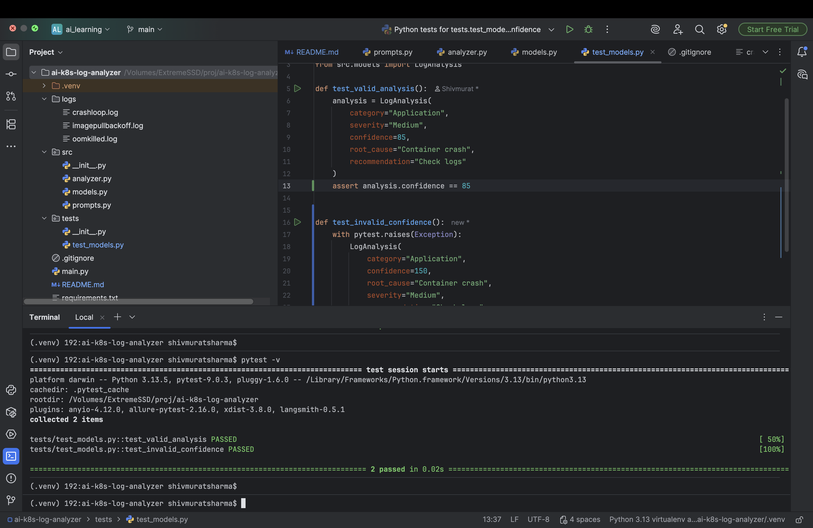
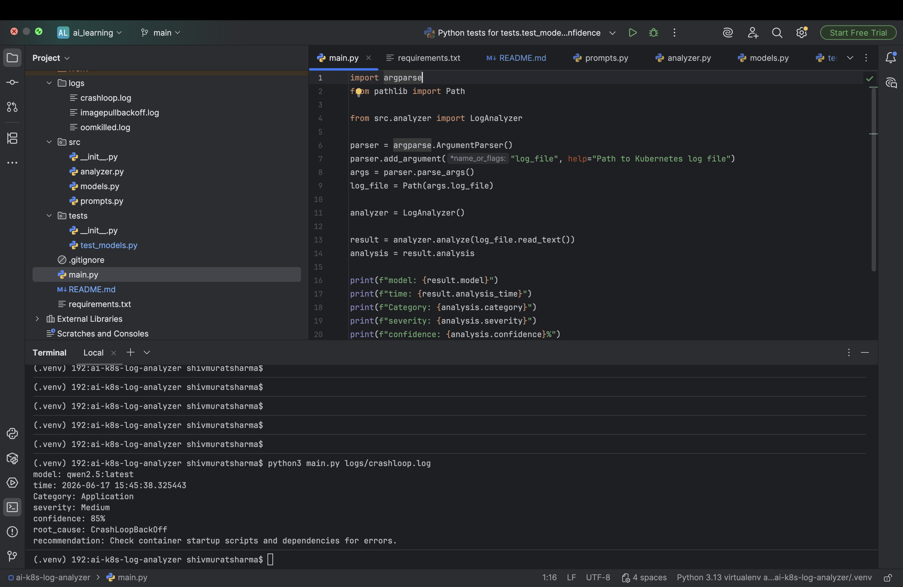

# AI Kubernetes Log Analyzer

# AI Kubernetes Log Analyzer


An AI-powered Kubernetes troubleshooting assistant that analyzes Kubernetes pod failure logs and produces structured root-cause analysis using a local LLM running on Ollama.

## Features

* Local LLM execution using Ollama
* Structured JSON responses
* Pydantic schema validation
* Failure categorization
* Severity classification
* Confidence scoring
* Sample Kubernetes failure scenarios

## Architecture

```text
Log File
    ↓
LogAnalyzer
    ↓
Ollama (Qwen2.5)
    ↓
Structured JSON
    ↓
Pydantic Validation
    ↓
AnalysisResult
```

## Tech Stack

* Python
* Ollama
* Qwen2.5
* Pydantic
* Pytest

## Project Structure

```text
ai-k8s-log-analyzer/
├── src/
│   ├── analyzer.py
│   ├── prompts.py
│   └── models.py
├── logs/
│   ├── crashloop.log
│   ├── imagepullbackoff.log
│   └── oomkilled.log
├── tests/
│   └── test_models.py
├── main.py
├── requirements.txt
└── README.md
```

## Installation

```bash
git clone <repo>
cd ai-k8s-log-analyzer

python3 -m venv .venv
source .venv/bin/activate

pip install -r requirements.txt
```

## Run

```bash
python main.py logs/crashloop.log
```

## Sample Output

```text
Model: qwen2.5:latest
Category: Application
Severity: Medium
Confidence: 85

Root Cause:
Container crashes and fails to restart successfully

Recommendation:
Check application logs and verify application dependencies.
```
## Unit Tests




## Future Enhancements

* Tool Calling
* Kubernetes API integration
* RAG-based troubleshooting
* Multi-agent root cause analysis
* Web UI
* GitHub Actions integration
